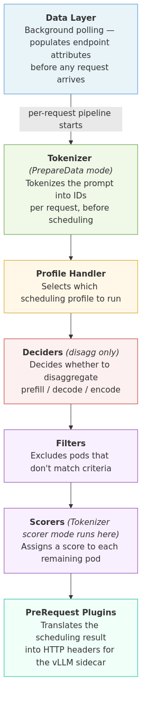

# llm-d Inference Scheduler Architecture

## Table of Contents

- [Overview](#overview)
- [Core Goals](#core-goals)
- [Architecture Design](#architecture-design)
  - [Pluggability](#pluggability)
- [Filters, Scorers, and Scrapers](#filters-scorers-and-scrapers)
  - [Core Design Principles](#core-design-principles)
  - [Routing Flow](#routing-flow)
  - [Lifecycle Hooks](#lifecycle-hooks)
  - [Configuration](#configuration)
    - [`Plugins` Configuration](#plugins-configuration)
    - [`SchedulingProfiles` Configuration](#schedulingprofiles-configuration)
  - [Available Plugins](#available-plugins)
- [Metric Scraping](#metric-scraping)
- [Disaggregated Encode/Prefill/Decode (E/P/D)](#disaggregated-encodeprefilldecodesepd-epd)
- [InferencePool & InferenceModel Design](#inferencepool--inferencemodel-design)
  - [Current Assumptions](#current-assumptions)
- [References](#references)

---

## Overview

**llm-d** is an extensible architecture designed to schedule inference requests efficiently across model-serving pods.
 A central component of this architecture is the **Inference Gateway**, which builds on the Kubernetes-native
 **Gateway API Inference Extension** (GIE) to enable scalable, flexible, and pluggable request scheduling.

The design enables:

- Support for **multiple base models** within a shared cluster (see [serving multiple inference pools](https://gateway-api-inference-extension.sigs.k8s.io/guides/serving-multiple-inference-pools-latest/))
- Efficient routing based on **KV cache locality**, **session affinity**, **load**, and
**model metadata**
- Disaggregated **Prefill/Decode (P/D)** execution
  - We have introduced experimental **Encode/Prefill/Decode (E/P/D and all its permutations)** execution. For a detailed explanation, see [Disaggregated Inference Serving](./disaggregation.md)
- Pluggable **filters**, **scorers**, and **scrapers** for extensible scheduling

---

## Core Goals

- Schedule inference requests to optimal pods based on:
  - Base model compatibility
  - KV cache reuse
  - Load balancing
- Support multi-model deployments on heterogeneous hardware
- Enable runtime extensibility with pluggable logic (filters, scorers, scrapers)
- Community-aligned implementation using GIE and Envoy + External Processing (EPP)

---

## Architecture Design


The inference scheduler is built on top of:

- The [Envoy] gateway, as a programmable data plane.
- An [EPP] (Endpoint Picker), making scheduling decisions, as the control plane.
  The llm-d inference scheduler extends the EPP in [GIE] with state of the art
  scheduling algorithms.
- An optional [BBR] (Body Based Routing) component, to associate requests with
  their corresponding model before the EPP is consulted.

[Envoy]:https://www.envoyproxy.io/
[EPP]:https://gateway-api-inference-extension.sigs.k8s.io/#endpoint-picker
[BBR]:https://gateway-api-inference-extension.sigs.k8s.io/#concepts-and-definitions
[GIE]:https://github.com/kubernetes-sigs/gateway-api-inference-extension

---

### Pluggability


Routing decisions are governed by dynamic components:

- **Profile Handlers**: Implement `scheduling.ProfileHandler` and control which scheduling profiles run and in what order
- **Filters**: Exclude pods based on static or dynamic criteria
- **Scorers**: Assign scores to candidate pods
- **Scrapers**: Collect pod metadata and metrics for scorers

These components are maintained in the `llm-d-inference-scheduler` repository and can evolve independently.
A [sample filter plugin guide](./create_new_filter.md) is provided to illustrate how one could extend the
 Inference Gateway functionality to address unique requirements.

---

## Filters, Scorers, and Scrapers

### Core Design Principles

- **Pluggability**: No core changes are needed to add new scorers or filters
- **Isolation**: Each component operates independently

---

### Routing Flow

1. **Filtering**
   - Pods in an `InferencePool` go through a sequential chain of filters
   - Pods may be excluded based on criteria like model compatibility, resource usage, or custom logic

2. **Scoring**
   - Filtered pods are scored using a weighted set of scorers
   - Scorers currently run sequentially (future: parallel execution)
   - Scorers access a shared datastore populated by scrapers

3. **Pod Selection**
   - The highest-scored pod is selected
   - If multiple pods share the same score, one is selected at random

---

### Lifecycle Hooks

- `Pre-call`
- `Scoring`
- `Post-choice`
- `After-response`


---

### Configuration

The inference scheduler relies on a YAML-based configuration—provided either as a file or an in-line parameter—to determine which lifecycle hooks (plugins) are active.

Specifically, this configuration establishes the following components:

- `Plugins`: The specific plugins to instantiate, along with their parameters. Because each instantiated plugin is assigned a unique name, you can configure the same plugin type multiple times if necessary.

- `SchedulingProfiles`: A collection of profiles that dictate the exact set of plugins invoked when scheduling a given request.

The configuration text has the following form:

```yaml
apiVersion: inference.networking.x-k8s.io/v1alpha1
kind: EndpointPickerConfig
plugins:
- ....
- ....
schedulingProfiles:
- ....
- ....
```

The first two lines of the configuration are constant and must appear as is.

### `Plugins` Configuration

The `plugins` section in the configuration defines the set of plugins that will be instantiated and their parameters. Each entry in this section has the following form:

```yaml
- name: aName
  type: a-type
  parameters:
    param1: val1
    param2: val2
```

#### `Plugin` Fields:

The fields in a plugin entry are:

- **name** (optional): provides a name by which the plugin instance can be referenced. If this field is omitted, the plugin's type will be used as its name.
- **type**: specifies the type of the plugin to be instantiated.
- **parameters** (optional): defines the set of parameters used to configure the plugin in question. The actual set of parameters varies from plugin to plugin.

### `SchedulingProfiles` Configuration

The `schedulingProfiles` section defines the set of scheduling profiles that can be used in scheduling
requests to pods. The number of scheduling profiles one defines, depends on the use case. For simple
serving of requests, one is enough. For disaggregated prefill, two profiles are required. Each entry
in this section has the following form:

```yaml
- name: aName
  plugins:
  - pluginRef: plugin1
  - pluginRef: plugin2
    weight: 50
```

#### `SchedulingProfile` Fields

The fields in a schedulingProfile entry are:

- **name**: specifies the scheduling profile's name.
- **plugins**: specifies the set of plugins to be used when this scheduling profile is chosen for a request.
- **pluginRef**: reference to the name of the plugin instance to be used
- **weight**: weight to be used if the referenced plugin is a scorer.

A complete configuration might look like this:

```yaml
apiVersion: inference.networking.x-k8s.io/v1alpha1
kind: EndpointPickerConfig
plugins:
- type: precise-prefix-cache-scorer
  parameters:
    indexerConfig:
      tokenProcessorConfig:
        blockSize: 5
      kvBlockIndexConfig:
        maxPrefixBlocksToMatch: 256
- type: decode-filter
- type: max-score-picker
- type: single-profile-handler
schedulingProfiles:
- name: default
  plugins:
  - pluginRef: decode-filter
  - pluginRef: max-score-picker
  - pluginRef: precise-prefix-cache-scorer
    weight: 50
```

If the configuration is in a file, the EPP command line argument `--configFile` should be used
 to specify the full path of the file in question. If the configuration is passed as in-line
 text the EPP command line argument `--configText` should be used.

---

### Available plugins

- **Data Layer** ([`datalayer.Extractor`](https://github.com/kubernetes-sigs/gateway-api-inference-extension/blob/main/pkg/epp/framework/interface/datalayer/plugin.go))
  - **Function**: Polls each pod in the background to collect metadata (e.g. model info) and makes it available to filters and scorers via endpoint attributes before any request is processed.
  - **Default:** `metrics-data-source` + `core-metrics-extractor` (auto-injected)
  - **Reference**: [datalayer/extractor/models/README.md](../pkg/epp/framework/plugins/datalayer/extractor/models/README.md)
- **Tokenizer** ([`scheduling.Scorer`](https://github.com/kubernetes-sigs/gateway-api-inference-extension/blob/main/pkg/epp/framework/interface/scheduling/plugins.go) / [`requestcontrol.PrepareDataPlugin`](https://github.com/kubernetes-sigs/gateway-api-inference-extension/blob/main/pkg/epp/framework/interface/requestcontrol/plugins.go))
  - **Function**: Converts incoming LLM prompts (both standard text completions and multi-modal chat messages) into token IDs for downstream filters and scorers. Communicates via Unix Domain Socket (UDS) with a tokenizer service from [`github.com/llm-d/llm-d-kv-cache/pkg/tokenization`](https://github.com/llm-d/llm-d-kv-cache), which runs as a separate sidecar container alongside the EPP pod. An embedded (in-process) alternative is also available in the same package. Fail-open: tokenization errors are logged and scheduling continues without token data.
  - **Reference**: [tokenizer/README.md](../pkg/epp/framework/plugins/requestcontrol/dataproducer/tokenizer/README.md)
- **Profile Handlers** ([`scheduling.ProfileHandler`](https://github.com/kubernetes-sigs/gateway-api-inference-extension/blob/main/pkg/epp/framework/interface/scheduling/plugins.go))
  - **Function**: Orchestrates the selection and execution order of scheduling profiles. Every configuration must include exactly one handler.
  - **Default:** [`single-profile-handler`](https://github.com/kubernetes-sigs/gateway-api-inference-extension/blob/main/pkg/epp/framework/plugins/scheduling/profile/single_profile_handler.go) (auto-injected when exactly one scheduling profile is defined and no handler is specified)
  - **Reference**: [profilehandler/README.md](../pkg/epp/framework/plugins/scheduling/profilehandler/README.md)
- **Deciders** (internal [`deciderPlugin`](../pkg/epp/framework/plugins/scheduling/profilehandler/disagg/decider-plugin.go))
  - **Function**: Determine whether disaggregation should be applied to a specific request. Wired into `disagg-profile-handler` via the `deciders` configuration field.
  - **Reference**: [profilehandler/README.md](../pkg/epp/framework/plugins/scheduling/profilehandler/README.md)
- **Filters** ([`scheduling.Filter`](https://github.com/kubernetes-sigs/gateway-api-inference-extension/blob/main/pkg/epp/framework/interface/scheduling/plugins.go))
  - **Function**: Excludes pods based on labels, label selectors, or specific pod roles.
  - **Reference**: [filter/bylabel/README.md](../pkg/epp/framework/plugins/scheduling/filter/bylabel/README.md)
- **Scorers** ([`scheduling.Scorer`](https://github.com/kubernetes-sigs/gateway-api-inference-extension/blob/main/pkg/epp/framework/interface/scheduling/plugins.go))
  - **Function**: Scores pods using metrics such as KV-cache prefix matching, session affinity, current load, and active request counts. Each scorer returns a value in `[0, 1]` per pod; that value is multiplied by the scorer's `weight` (set in `schedulingProfiles`) and accumulated across all scorers into a final score per pod. The pod with the highest total is selected. Weight controls each scorer's relative influence — omitting it defaults to `0`, meaning the scorer has no effect.
  - **Default:** `queue-scorer`, `kv-cache-utilization-scorer`, `prefix-cache-scorer`
  - **Reference**: [scorer/README.md](../pkg/epp/framework/plugins/scheduling/scorer/README.md)
- **PreRequest Plugins** ([`requestcontrol.PreRequest`](https://github.com/kubernetes-sigs/gateway-api-inference-extension/blob/main/pkg/epp/framework/interface/requestcontrol/plugins.go))
  - **Function**: Run after scheduling and before the request is forwarded. Translate scheduling results into HTTP headers consumed by the vLLM sidecar.
  - **Reference**: [profilehandler/README.md](../pkg/epp/framework/plugins/scheduling/profilehandler/README.md)

**Plugins Pipeline**



---

## Metric Scraping

- Scrapers collect metrics (e.g., memory usage, active adapters)
- Data is injected into the shared datastore for scorers
- Scoring can rely on numerical metrics or metadata (model ID, adapter tags)

---

## Disaggregated Encode/Prefill/Decode (E/P/D)

When enabled, the router:

- Selects one pod for **Prefill** (prompt processing)
- Selects another pod for **Decode** (token generation)

> [!NOTE] 
> Encode disaggregation is an experimental feature. When enabled, the router 
> identifies all pods capable of encoding, and the vLLM sidecar distributes multimedia 
> requests to randomly selected pods from that subset. More sophisticated selection 
> strategies are planned for future versions.

The **vLLM sidecar** handles orchestration between Encode, Prefill and Decode stages. It allows:

- Queuing
- Local memory management
- Experimental protocol compatibility

> [!NOTE]
> The detailed E/P/D design is available in this document:
> [Disaggregated Inference Serving in llm-d](./disaggregation.md)

---

## InferencePool & InferenceModel Design

### Current Assumptions

- Single `InferencePool` and single `EPP` due to Envoy limitations
- Model-based filtering can be handled within EPP
- Currently only one base model **per `InferencePool`** is supported.
  Multiple models are supported via multiple `InferencePools`.

> [!NOTE]
> The `InferenceModel` CRD is in the process of being significantly changed in IGW.
> Once finalized, these changes would be reflected in llm-d as well.

---

## References

- [GIE Spec](https://gateway-api-inference-extension.sigs.k8s.io/)
- [Envoy External Processing](https://www.envoyproxy.io/docs/envoy/latest/configuration/http/http_filters/ext_proc_filter)
